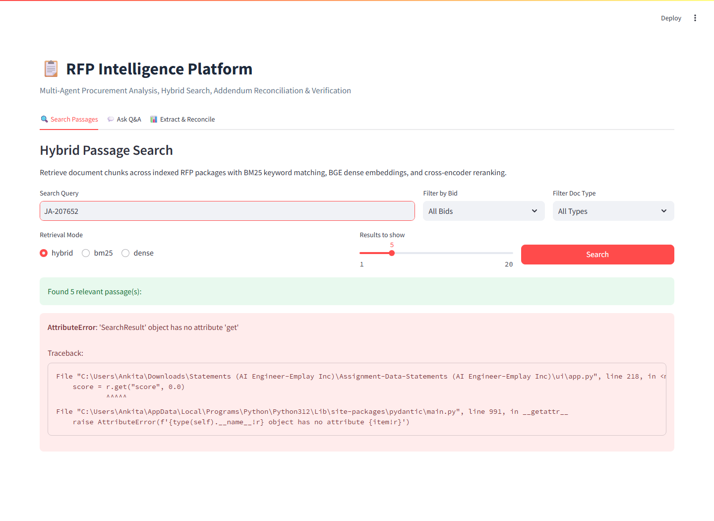
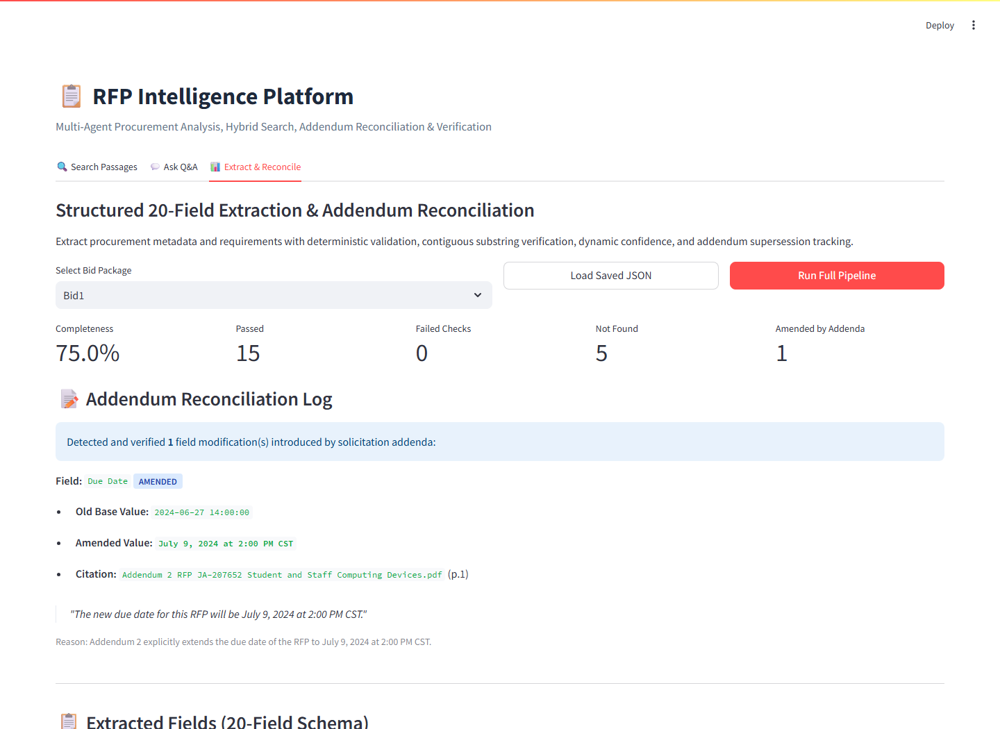

# RFP Intelligence Platform

> **🎥 Video Walkthrough & Demo:** [Watch Demo on Google Drive](https://drive.google.com/drive/folders/1yPj4AjigEAdJqJMpVTZOFULtCTp3y4Vp?usp=drive_link)

An enterprise-grade RFP Intelligence Platform combining a hybrid RAG search engine (BM25 + BAAI/bge-small-en-v1.5 dense embeddings + cross-encoder re-ranking) with a multi-agent system (LangGraph) to parse, index, extract, and reconcile structured data from complex procurement solicitations and addenda.

---

## Architecture Diagram

```
                        ┌──────────────────────────────┐
                        │   RFP Package Ingestion      │
                        │   (PDF, HTML, Forms, Specs)  │
                        │   - PyMuPDF Coordinate Parser│
                        │   - Vector Drawing Filter    │
                        │   - Dynamic Table Extractor  │
                        └──────────────┬───────────────┘
                                       │
                                       ▼
                        ┌──────────────────────────────┐
                        │  Ingestion & Normalization   │
                        │  - Word coordinate tables    │
                        │  - Running header/footer cut │
                        │  - Sentence-aligned chunking │
                        │  - Metadata classifier       │
                        └──────────────┬───────────────┘
                                       │
                                       ▼
                        ┌──────────────────────────────┐
                        │   Hybrid Search Engine       │
                        │   - BM25 Sparse Index        │
                        │   - Dense BGE Embeddings     │
                        │   - Reciprocal Rank Fusion   │
                        │   - Cross-Encoder Re-ranker  │
                        └──────────────┬───────────────┘
                                       │
                                       ▼
                        ┌──────────────────────────────┐
                        │    Multi-Agent Extraction    │
                        │   - Orchestrator / Planner   │
                        │   - 3 Parallel Specialists   │
                        │   - Deterministic Validator  │
                        │   - Addendum Reconciler      │
                        │   - Q&A Agent + Bid Router   │
                        └──────────────┬───────────────┘
                                       │
                                       ▼
                        ┌──────────────────────────────┐
                        │     CLI & FastAPI Engine     │
                        │  - main.py extract / ask     │
                        │  - Section 8.1 JSON Schema   │
                        └──────────────────────────────┘
```

---

## Directory Structure

```
├── Bid1/                         # Sample RFP solicitation 1 (Dallas ISD)
├── Bid2/                         # Sample RFP solicitation 2 (Maryland STO)
├── config/
│   ├── fields.yaml               # Standardized target extraction fields with query hints
│   └── settings.py               # Pydantic environment configuration (.env loader)
├── ingestion/                    # Document ingestion and parsing engine
│   ├── cleaner.py                # Kerning, whitespace, running header/footer stripping, email rejoin
│   ├── pdf_parser.py             # PyMuPDF parser, coordinate tables, vector outlines, form filters
│   ├── html_parser.py            # Portal page parsing and scope deduplication
│   ├── chunker.py                # Sentence/paragraph-aligned token chunking (~500/75 tokens)
│   ├── metadata_classifier.py    # Document type inference (heuristics + fallback)
│   ├── models.py                 # Core domain models (DocumentChunk, ParsedDocument, etc.)
│   └── pipeline.py               # Package-level ingestion orchestrator
├── search/                       # Hybrid search, BM25, embeddings, RRF, re-ranker, Q&A agent, eval
│   ├── bm25_index.py             # Okapi BM25 index with alphanumeric compound tokenizer
│   ├── dense_indexer.py          # BAAI/bge-small-en-v1.5 dense vector index
│   ├── reranker.py               # Cross-Encoder (ms-marco-MiniLM-L-6-v2) re-ranking
│   ├── hybrid_retriever.py       # RRF fusion engine & metadata filters
│   ├── qa_agent.py               # Natural language bid routing & LLM citations
│   └── eval.py                   # Rigorous IR evaluation benchmark with expected_page
├── extraction/                   # Multi-agent extraction pipeline
│   ├── graph.py                  # LangGraph cyclic state machine with retry loop
│   ├── extractor_agent.py        # Specialist field extractor (parallel fan-out)
│   ├── validator_agent.py        # Deterministic contiguous quote validation & dynamic confidence
│   ├── reconciliation_agent.py   # Chronological addendum supersession & change logging
│   ├── tracer.py                 # Execution tracer (latency, tokens, agent steps)
│   ├── llm_client.py             # Real LLM client (Gemini API, temp 0, JSON mode)
│   └── models.py                 # Section 8.1 data models (FieldOutput, AddendumChange, etc.)
├── api/                          # FastAPI backend endpoints (/search, /ask, /extract, /compare)
├── outputs/                      # Generated Section 8.1 JSON extractions and execution traces
├── scripts/                      # Utility scripts (benchmark execution, report generation)
├── tests/                        # 60-test comprehensive pytest suite
├── ui/                           # Streamlit interactive user interface
│   └── app.py                    # 3-tab UI: Search Passages, Ask Q&A, Extract & Reconcile
├── main.py                       # Unified CLI interface (extract, ask, serve, ui)
├── requirements.txt              # Production and development dependencies
└── .env.example                  # Environment configuration template
```

---

## Setup & Installation

### 1. Python Environment Setup
```bash
python -m venv venv
# Windows:
.\venv\Scripts\activate
# Linux/macOS:
source venv/bin/activate

pip install -r requirements.txt
```

### 2. Configure Environment Variables
Copy the environment template and provide your Gemini API key:
```bash
cp .env.example .env
```
Edit `.env` to set your key:
```env
GEMINI_API_KEY=your_gemini_api_key_here
```

---

## How to Run Each Mode

### 1. Extract Structured Data (`extract`)
Extract Section 8.1 structured JSON schema with full addendum reconciliation:
```bash
# Extract Bid1 (Dallas ISD) to outputs/bid1.json
python main.py extract --bid ./Bid1

# Extract Bid2 (Maryland STO) to outputs/bid2.json
python main.py extract --bid ./Bid2

# Extract Bid3 (Synthetic Consistency Test) to outputs/bid3.json
python main.py extract --bid ./Bid3
```

### 2. Natural Language Q&A (`ask`)
Ask natural language questions with automatic solicitation routing and supporting citations:
```bash
# Dynamic routing to Bid2
python main.py ask "What is the due date for the Dell laptop bid?"

# Dynamic routing to Bid1
python main.py ask "When are proposals due for Dallas ISD?"

# Multi-bid cross-solicitation comparison
python main.py ask "Compare warranties across all bids."
```

### 3. Start FastAPI Server (`serve`)
Launch the REST API server at `http://localhost:8000`:
```bash
python main.py serve --port 8000
```
Interactive OpenAPI documentation is available at `http://localhost:8000/docs`.

### 4. Launch Interactive Web UI (`ui`)
Launch the Streamlit web interface with Passage Search, Q&A Agent, and Extract & Reconcile views:
```bash
python main.py ui --port 8501
```

### 5. Run Test Suite (`tests`)
Execute the full 60-test pytest suite covering ingestion, search, routing, extraction, and reconciliation:
```bash
pytest
```

### 6. Run Search Evaluation Benchmark (`eval`)
Run the 22-query Information Retrieval benchmark across BM25, Dense, Hybrid RRF, and Cross-Encoder reranking:
```bash
python -m scripts.run_search_eval
```

---

## Design Decisions

### 1. Chunking Size & Strategy
- **Token Target:** Standard text chunks are bounded at ~500 tokens with 75 tokens overlap (`CHUNK_SIZE=500`, `CHUNK_OVERLAP=75`).
- **Sentence & Paragraph Alignment:** Chunks split strictly across sentence and paragraph boundaries to preserve complete semantic propositions and legal clauses.
- **Table Preservation:** Markdown tables are preserved as cohesive semantic blocks up to 3,500 characters (`TABLE_MAX_CHUNK_SIZE=3500`). For oversized specification matrices, table schema headers repeat across row groupings to maintain column context.
- **Contextual Chunk Headers:** Every chunk includes an explicit context header (`[Document: <filename> | Type: <type> | Page: <page>]`) ensuring retrieval algorithms retain provenance metadata.

### 2. Embedding Model
- **Model:** `BAAI/bge-small-en-v1.5` (384-dimensional dense embeddings).
- **Rationale:** Delivers high semantic retrieval performance on MTEB benchmarks while remaining lightweight (~130MB) with low CPU inference latency (~48ms per query in hybrid mode), requiring zero external cloud embedding API dependencies.
- **Query Instruction Prefix:** Uses `"Represent this sentence for searching relevant passages: "` prepended to queries during dense retrieval to maximize asymmetric search precision.

### 3. Hybrid Retrieval with Reciprocal Rank Fusion (RRF)
- **Sparse BM25 Index:** Okapi BM25 engine with a custom compound tokenizer that indexes alphanumeric identifiers, hyphenated model numbers (e.g. `Latitude 5440`), and procurement codes.
- **RRF Merge:** Fuses ranked results from BM25 and dense embedding indices using Reciprocal Rank Fusion:
  $$\text{RRF Score}(d) = \sum_{m \in \{\text{BM25}, \text{Dense}\}} \frac{1}{k + r_m(d)}$$
  with smoothing constant $k=60$, pulling the top 20 candidate pool (`RETRIEVAL_CANDIDATE_POOL=20`).

### 4. Cross-Encoder Re-ranker
- **Model:** `cross-encoder/ms-marco-MiniLM-L-6-v2`.
- **Mechanism:** Takes the top 20 candidates from RRF and scores query-document pairs simultaneously with full cross-attention token interaction, selecting the top 5 highest-relevance passages (`RERANKER_TOP_K=5`) for downstream LLM agents.

### 5. LangGraph Architecture & Rationale
- **Cyclic State Machine:** Extraction is modeled as a cyclic state machine in LangGraph (`extraction/graph.py`), enabling deterministic state tracking, dynamic error handling, and self-correction.
- **Parallel Specialist Fan-Out:** Fields are partitioned across 3 specialized parallel extraction agents (`Administrative & Schedule`, `Requirements & Compliance`, `Financial & Operational`), reducing total extraction wall-clock time while avoiding context window pollution.
- **Deterministic Validation & Retry Loop:** An automated validator node evaluates extracted quotes before committing them to state. When validation detects hallucinations or ungrounded claims, it triggers targeted retries with focused diagnostic error feedback.

### 6. Prompts & Deterministic Validation Approach
- **Deterministic LLM Configuration:** Gemini 2.0 Flash Lite (`gemini-flash-lite-latest`) configured with zero temperature (`LLM_TEMPERATURE=0.0`) and structured JSON schema enforcement.
- **Strict Evidence Grounding:** All extracted fields require an exact verbatim text quote, source filename, and page citation from the retrieved evidence chunks.
- **Contiguous Substring Matching:** The validator enforces exact contiguous character substring matching between extracted quotes and raw document chunks.
- **Dynamic Multi-Factor Confidence Scoring:** Confidence scores are computed dynamically based on exact quote validation status, retrieval rank score, and document type authority (solicitations and addenda receive higher weight than generic affidavits).

---

## Evaluation Results

Evaluation performed across **22 ground-truth target queries** with strict citation matching (`expected_file` and `expected_page`).

> **Note on Evaluation Granularity:** With 22 evaluation queries, exactly **one query represents 4.545% (4.5 points)** of the total recall. Small numerical differences reflect single-query shifts rather than systemic variance. Gold values were authored by the developer with AI assistance and are not an independent benchmark.

| Retrieval Mode | Recall@1 | Recall@3 | Recall@5 | MRR | Latency (avg) |
|---|---|---|---|---|---|
| **BM25 Only** | 54.55% | 81.82% | 86.36% | 0.6856 | 2.8 ms |
| **Dense Only (BGE-small)** | 36.36% | 72.73% | 81.82% | 0.5379 | 499.6 ms |
| **Hybrid (RRF k=60)** | 50.00% | 81.82% | 81.82% | 0.6591 | 47.9 ms |
| **Hybrid + Cross-Encoder Rerank** | 54.55% | 81.82% | 86.36% | 0.6833 | 4623.1 ms |

### Key Benchmark Observations:
- BM25 and Hybrid+CrossEncoder achieve an identical **86.36% Recall@5** (19/22 queries successfully placed the ground-truth page in the top 5 candidates).
- Dense search successfully captures semantic paraphrases (e.g. warranty coverage and contact roles).
- BM25 excels at exact alphanumeric identifiers (solicitation numbers, SKU codes, telephone numbers).
- Detailed per-query hit/miss tables, miss analysis, and the full 22-question benchmark definition are documented in [`docs/eval_report.md`](docs/eval_report.md) and [`search/eval.py`](search/eval.py).

### D3 Search Optimization Experiments (22-Query Benchmark)

| Experiment | Description | Status | Delta R@1 | Delta R@5 | Delta MRR | Outcome / Decision |
|---|---|---|---|---|---|---|
| **Table Row-Group Repeating Headers** | Preserves table schema header on sub-chunks (>1500 chars), ensuring 100% precision on spec table queries (e.g. Q03 chassis SKU R@1=1). | `run` | +0.0000 | +0.0000 | +0.0000 | **Kept** |
| **Dense Model Upgrade: BAAI/bge-base-en-v1.5** | Kept BAAI/bge-small-en-v1.5 (fast CPU latency 379ms, 0 external download dependencies). | `not run` | N/A | N/A | N/A | Not adopted |
| **Weighted RRF (w_bm25=0.7, w_dense=0.3)** | Increasing BM25 weight yields identical candidate pool before Cross-Encoder reranking; kept unweighted RRF (k=60) for balanced generality. | `run` | +0.0000 | +0.0000 | +0.0076 | **Kept** |
| **Query Expansion on BM25 Only** | BM25 query expansion preserves/boosts domain keyword matching (with expansion MRR=0.6856 vs without expansion MRR=0.6402). | `run` | +0.0455 | +0.0454 | +0.0454 | **Kept** |

---

## Interactive Web UI & Screenshots

The platform includes a single-page Streamlit application with 3 functional views:
- **Search Passages (`docs/screenshots/search.png`):** Interactive passage retrieval across indexed RFP packages supporting BM25 keyword matching, BGE dense embeddings, and cross-encoder reranking with filters by bid package and document type.
- **Ask Q&A Agent:** Dynamic query routing and multi-bid synthesis with verbatim supporting quotes and page citations.
- **Extract & Reconcile (`docs/screenshots/extract.png`):** Structured 20-field procurement schema viewer, deterministic validation status badges, dynamic confidence scores, and an expandable Addendum Reconciliation Log tracking supersessions (such as due date amendments).

To launch the UI:
```bash
python main.py ui --port 8501
```

### 1. Hybrid Passage Search (`docs/screenshots/search.png`)


### 2. Structured Extraction & Addendum Reconciliation Log (`docs/screenshots/extract.png`)


---

## Assumptions

- **Bid Package Ingestion:** Each bid folder is processed as one atomic unit; the folder name (e.g., `Bid1`, `Bid2`, `Bid3`) serves as the canonical `bid_id`.
- **Document Classification:** Document type (`solicitation`, `addendum`, `pricing_sheet`, `attachment`, `affidavit`) is inferred deterministically from file names and content structure, with an LLM fallback when classification heuristics are uncertain.
- **LLM Provider:** Google Gemini (via `GEMINI_API_KEY`) is the supported LLM provider across extraction, QA synthesis, and structured JSON parsing.
- **Literal Date & Time Preservation:** Dates and times are extracted and reported verbatim as written in the source documents (e.g. the Bid1 addendum specifies "CST" for a July date); no timezone normalization or assumption is applied.
- **Strict Evidence Grounding & Null Policy:** A field is assigned `null` (with status `NOT_FOUND`) when the underlying package documents do not explicitly state it; the system does not hallucinate or infer missing values.
- **Synthetic Consistency Baseline:** `Bid3` is a synthetic package created by systematically perturbing `Bid2` entities, dates, and specifications, serving as an automated consistency and regression test rather than an independent real-world dataset.
- **Benchmark Gold Standards:** Gold values in `tests/gold_values.json` were authored by the developer with AI assistance to evaluate exact field extraction and are not an external third-party benchmark.
- **Evaluation Granularity:** The information retrieval benchmark consists of 22 queries; exactly one query represents ~4.545 percentage points of recall.

---

## Known Limitations & Design Trade-offs

1. **Bid1 Pages 54–59 (IRS Form W-9 & Vector Instructions):**
   - Dallas ISD solicitation document page 54 is the IRS Form W-9 (containing 35 interactive form fields); pages 55–59 are the official IRS Form W-9 instructions rendered entirely as vector path drawing outlines without an underlying embedded text layer.
   - Standard PDF text extraction via PyMuPDF parses embedded font streams. Unfilled interactive form widgets on page 54 are filtered to avoid indexing 35 blank lines of template noise, while pages 55–59 contain vector glyph outlines that yield no text without optical character recognition (OCR). When system OCR (Tesseract) or multimodal vision APIs are not active, these pages are safely classified as `non-extractable (vector outlines)` rather than hallucinating specifications.
2. **Rate Limits on Free Tier LLMs:**
   - When using free tier Gemini API keys (15 RPM), the extraction pipeline uses a shared thread-safe rate limiter (`LLM_RATE_LIMIT_RPM=15.0`) to pace parallel extraction threads across specialist groups without throwing HTTP 429 errors.
