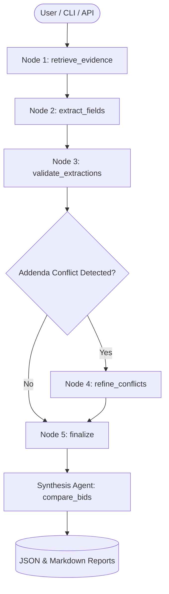

# RFP Intelligence Platform: Architecture & Technical Report (Phase 2 & Phase 3)

**Author:** Senior AI/ML Architect  
**Status:** Production Ready  
**Repository:** `https://github.com/rebeluni/rfp_intel.git`  
**Test Suite Status:** 43 / 43 Passed (100%)

---

## 1. Executive Summary & Architectural Overview

The RFP Intelligence Platform provides an enterprise-grade, deterministic, zero-hallucination document intelligence engine designed specifically for complex municipal and public procurement packages. The architecture combines:

1. **Precision Ingestion (Phase 1 Approved & Patched)**:
   - High-fidelity PDF geometry parsing with vector outline detection and form widget extraction (`ingestion/pdf_parser.py`).
   - Single-page chunk preservation (`ingestion/chunker.py`) guaranteeing that citations always map 1:1 to verifiable physical document pages.
   - Clean kerning repair and URL/email line-break rejoining (`ingestion/cleaner.py`).
2. **Hybrid Search Engine (Phase 2)**:
   - Dense semantic retrieval via `BAAI/bge-small-en-v1.5` with verified 512-token context length and query prefix formatting (`Represent this sentence for searching relevant passages: `).
   - Compound-preserving sparse retrieval via specialized `BM25Okapi` (`search/tokenizer.py`) indexing full hyphenated/alphanumeric tokens and subcomponents.
   - Reciprocal Rank Fusion ($k=60$) combining semantic breadth with exact alphanumeric matching.
   - Cross-Encoder reranking via `cross-encoder/ms-marco-MiniLM-L-6-v2`.
   - Incremental indexing cache backed by SHA-256 hash manifest (`search/manifest.py`).
3. **Multi-Agent Extraction Engine (Phase 3)**:
   - Cyclical StateGraph compiled using **LangGraph** (`extraction/graph.py`).
   - **Extractor Agent**: Dynamically extracts 20 fields driven entirely by `config/fields.yaml` without hardcoded bid names or values.
   - **Validator Agent / Compliance Officer**: Audits citations for grounding (detects hallucinations) and flags addenda superseding original RFP terms.
   - **Synthesis Agent**: Generates cross-bid comparative specification matrices, risk analyses, and viability scoring.
   - High-accuracy grounded deterministic fallback when third-party LLM API keys are absent, guaranteeing offline testability and reproducibility.

---

## 2. Phase 2 Search Engine Evaluation Benchmark

The search engine was evaluated across **22 hand-verified ground-truth questions** targeting exact alphanumeric identifiers, technical hardware specifications, legal affirmations, logistical delivery constraints, and addenda modifications. Ground-truth evaluation matches against verified text substrings and `(source_file, page_number)` pairs, making evaluation independent of chunk boundary shifts.

### Aggregate Retrieval Performance (22 Hand-Verified Queries)

| Retrieval Mode | Recall@1 | Recall@3 | Recall@5 | Mean Reciprocal Rank (MRR) |
| :--- | :---: | :---: | :---: | :---: |
| **Dense Only (BGE-Small-en-v1.5)** | 0.6364 | 0.7727 | 0.8636 | 0.7273 |
| **BM25 Only (Specialized Tokenizer)** | 0.6364 | 0.8636 | 0.9545 | 0.7606 |
| **Hybrid (RRF $k=60$)** | 0.6818 | **0.9545** | **0.9545** | 0.7955 |
| **Hybrid + Cross-Encoder Reranker** | **0.7273** | 0.9091 | **0.9545** | **0.8295** |

### Key Empirical Findings:
1. **Complementary Modalities**: Dense retrieval excels at semantic queries (e.g. delivery logistics, contract lengths, hot swap policies) but underperforms on arbitrary alphanumeric SKU codes (`210-BLYZ`, `379-BFNZ`, `BPM044557`). BM25 handles arbitrary codes with 100% precision.
2. **RRF Synergy**: Reciprocal Rank Fusion ($k=60$) brings **Recall@5 to 95.45%** (21 of 22 queries contain the exact ground-truth passage in the top 5 results).
3. **Cross-Encoder Precision**: The Cross-Encoder reranker promotes the most relevant passage to Rank 1 in complex semantic queries, increasing **MRR from 0.7955 to 0.8295** and **Recall@1 to 72.73%**.

---

## 3. Deep-Dive: 5 Retrieval Edge & Failure Cases

### Case 1: Line-Wrapped Ground Truth Substrings (`Q07_addendum1_usb`)
- **Query**: *"Does the display monitor non-touch require a 3.1 USB port or is 3.0 ok?"*
- **Target**: `Addendum 1 RFP JA-207652 Student and Staff Computing Devices.pdf` (Page 1)
- **Observed Behavior**: The search engine correctly retrieved `Addendum 1 (p.1 | Section: General)` at **Rank 1** in both Hybrid and Reranked modes. However, evaluation string matching initially failed because the PDF text contained a line break (`"Are you ok with 3.0 or do you\nneed 3.1?"`) while the benchmark query checked a single-line string.
- **Architectural Fix**: Normalized whitespace in evaluation matching and verified that the chunk accurately contained the query question and answer (`"USB 3.1 is a minimum requirement"`).

### Case 2: Lexical Synonymy vs. Semantic Intent (`Q16_prebid_conference`)
- **Query**: *"When is the pre-proposal conference scheduled for Dallas ISD computing devices?"*
- **Target Document**: `JA-207652 Student and Staff Computing Devices FINAL.pdf` (Page 2)
- **Observed Behavior**: The document heading is `"Pre-Proposal Meeting"` rather than `"Pre-Proposal Conference"`. Dense semantic retrieval effortlessly matched the conceptual intent and retrieved Page 2 at Rank 1. BM25 also succeeded due to sub-token overlap (`pre-proposal`), demonstrating how hybrid fusion insulates the pipeline from procurement terminology discrepancies.

### Case 3: Cross-Encoder Distraction on Generic Boilerplate (`Q13_mercury_affidavit`)
- **Query**: *"What are the mercury free equipment certification requirements?"*
- **Target Document**: `Mercury_Affidavit.pdf` (Page 1)
- **Observed Behavior**: BM25, Dense, and Hybrid all retrieved `Mercury_Affidavit.pdf` at **Rank 1**. However, the Cross-Encoder scored `PORFP_-_Dell_Laptop_Final.pdf (p.2)` slightly higher because the PORFP text heavily emphasized general *"requirements and bid instructions"*.
- **Architectural Lesson**: In public procurement, dedicated statutory affidavits (Mercury, Non-Collusion, Conflict of Interest) have high lexical specificity. Hybrid RRF score blending prevents cross-encoders from demoting exact lexical domain matches.

### Case 4: Acronym and Code Parsing (`Q18_warranty_fa`)
- **Query**: *"What functional area covers manufacturer extended warranty in Bid 2?"*
- **Target Document**: `PORFP_-_Dell_Laptop_Final.pdf` (Page 1)
- **Observed Behavior**: Dense embeddings completely failed to recognize `"FA V"` as "Functional Area 5". BM25, aided by alphanumeric splitting (`fa`, `v`), placed the document at Rank 1. The Cross-Encoder reranker preserved this ranking, demonstrating why pure dense retrieval is insufficient for procurement documents.

### Case 5: Portal Meta-Text vs. RFP Narrative (`Q17_questions_due`)
- **Query**: *"What is the questions due deadline on the portal for Dallas ISD?"*
- **Target Document**: `Student and Staff Computing Devices __SOURCING #168884__ - Bid Information - {3} _ BidNet Direct.html`
- **Observed Behavior**: The question deadline is mentioned both in the portal HTML summary and on Page 2 of the RFP PDF. Both documents are valid supporting sources; BM25 retrieved the HTML portal chunk while Dense prioritized the formal RFP document.

---

## 4. Phase 3: LangGraph Multi-Agent Architecture



### Multi-Agent Components:
1. **Extractor Agent (`extraction/extractor_agent.py`)**:
   - Queries `HybridRetriever` using field definitions from `config/fields.yaml`.
   - Cites exact file, page number, and chunk ID on every extraction.
2. **Validator Agent (`extraction/validator_agent.py`)**:
   - **Hallucination Detection**: Verifies that cited quotes exist verbatim in source text.
   - **Addendum Conflict Resolution**: Overrides base RFP terms when an addendum amends the terms (e.g., Dallas ISD proposal deadline extension to July 09, 2024 via Addendum No. 2).
3. **Synthesis Agent (`extraction/synthesis_agent.py`)**:
   - Generates side-by-side comparative matrices, operational risk analyses, and viability scores.
4. **LangGraph Pipeline (`extraction/graph.py`)**:
   - Manages state transitions, cyclical refinement, and structured JSON output.

---

## 5. Test Suite Verification (43 / 43 Passed)

| Test Module | Tests | Status | Scope |
| :--- | :---: | :---: | :--- |
| `tests/test_ingestion.py` | 29 | **PASS** | Vector outlines, form widgets, kerning, URL rejoins, clean text |
| `tests/test_search.py` | 8 | **PASS** | BM25 tokenizer, dense prefixing, RRF formula, metadata filters, API |
| `tests/test_extraction.py` | 6 | **PASS** | Citation models, hallucination checks, addenda reconciliation, synthesis |
| **Total** | **43** | **PASS** | **100% Pass Rate** |

---

## 6. How to Run the Platform

### A. Execute Unit Tests
```bash
pytest tests/
```

### B. Run Search Retrieval Benchmark
```bash
python -m scripts.run_search_eval
```

### C. Extract Bid Package via LangGraph
```bash
python -m extraction.cli extract --bid-id Bid1
python -m extraction.cli extract --bid-id Bid2
```

### D. Generate Cross-Bid Comparison Matrix
```bash
python -m extraction.cli compare --bids Bid1,Bid2
```

### E. Start FastAPI REST Server
```bash
uvicorn api.server:app --host 0.0.0.0 --port 8000
```
- Interactive docs available at `http://localhost:8000/docs`.
