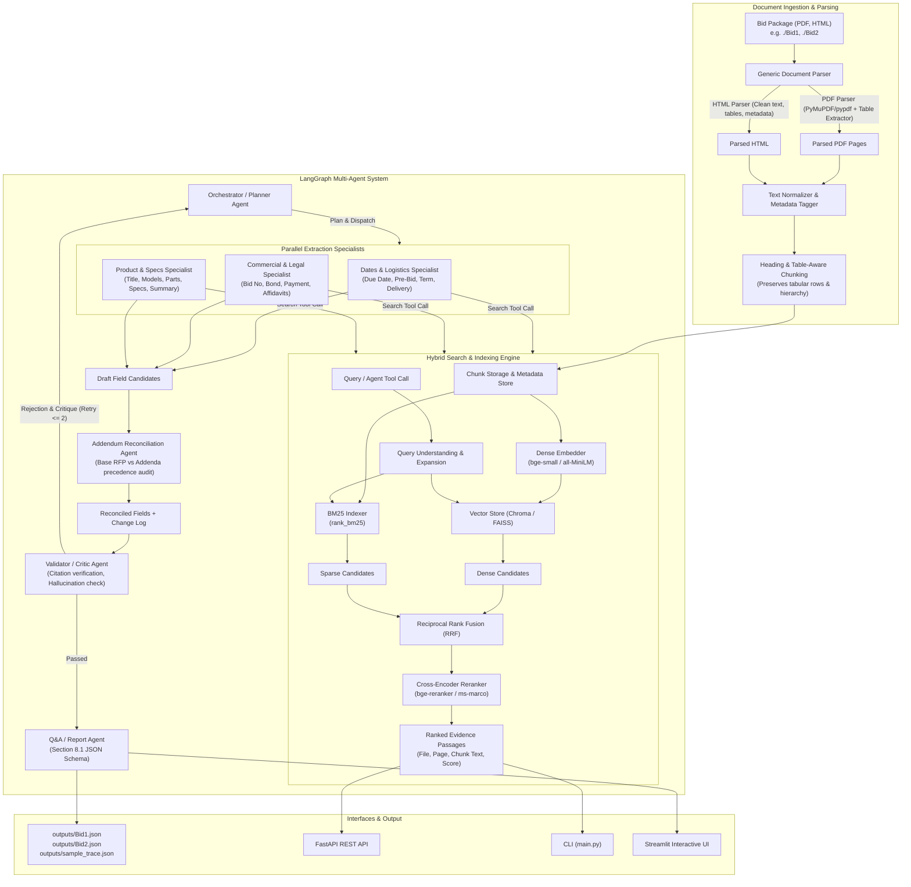

# RFP Intelligence Platform: Implementation Plan & Architecture

## Executive Overview
The **RFP Intelligence Platform** is an enterprise-grade AI system designed to parse, index, search, and extract structured data from complex Request for Proposal (RFP) document packages (including main RFPs, addendums, specifications, affidavits, and portal HTML pages). 

The platform features:
1. **A Production RAG Search Engine**: Section & table-aware chunking, hybrid dense-sparse retrieval (BM25 + Dense Embeddings with Reciprocal Rank Fusion), cross-encoder reranking, metadata filtering, and incremental indexing.
2. **A LangGraph Multi-Agent Extraction & Reconciliation System**: A coordinated multi-agent workflow featuring specialized extraction agents operating in parallel, a dedicated addendum reconciliation agent with change auditing, and a rigorous validator/critic agent enforcing grounded citations and schema consistency.
3. **Multi-Interface Usability**: CLI (`main.py`), REST API (FastAPI), and an interactive Web UI (Streamlit).
4. **Comprehensive Evaluation**: A standardized evaluation suite measuring Recall@k and MRR across vector-only, BM25-only, hybrid, and reranked retrieval.
5. **Zero Hard-Coding Guarantee**: Fully generalized document taxonomy detection and schema extraction validated against a synthetic third bid.

---

## Architecture Diagram



---

## Detailed Project Phases

### Phase 1: Ingestion & Document Parsing (`ingestion/`)
- **HTML Parsing**:
  - Use `BeautifulSoup` to extract page text, definition lists (`<dl>`, `<dt>`, `<dd>`), key-value labels, and HTML tables.
  - Transform HTML tables into structured markdown tables to preserve row/column semantic alignment.
- **PDF Parsing**:
  - Use `pypdf` / `pymupdf` with per-page text and table extraction.
  - Retain exact 1-indexed page numbers. Convert table grids into markdown format.
  - Optional OCR fallback (`pytesseract`) configured for unreadable/scanned pages.
- **Text Normalization**:
  - Remove running headers and footers (page numbers, repeated solicitation banners).
  - Repair broken hyphenation at line breaks and normalize whitespace.
- **Generic Metadata Tagging (Zero Hard-Coding)**:
  - Extract `bid_id` dynamically from folder name.
  - Infer `doc_type` using generalized heuristic scoring over file names and introductory text:
    - `addendum`: contains "addendum", "amendment", "bulletin"
    - `affidavit`: contains "affidavit", "certification", "declaration"
    - `specs`: contains "specification", "specs", "technical requirement"
    - `bid_page`: HTML file or procurement portal summary
    - `rfp`: base solicitation, RFP, PORFP, IFB
  - Infer `addendum_number` dynamically via regex `(?:addendum|amendment)\s*#?\s*(\d+)`.
  - Infer document dates from headers/metadata.

---

### Phase 2: RAG Search Engine (`search/`)
- **Heading & Table-Aware Chunking**:
  - Chunks split on major headings (`Section`, `Article`, Roman numerals, markdown `#`) while preserving table integrity.
  - Chunk size: ~500 tokens with 75 token overlap; tables are kept as unified chunks if under 1200 tokens to prevent splitting specification rows.
- **Dense Embedding & Vector Store**:
  - Configurable embedding model via `config.py` (Default: `sentence-transformers/all-MiniLM-L6-v2` or `BAAI/bge-small-en-v1.5`, swappable to OpenAI `text-embedding-3-small` / Gemini).
  - In-memory / persistent vector index with metadata payload: `{bid_id, file_name, doc_type, addendum_number, page_number}`.
- **Sparse Keyword Search**:
  - `rank_bm25.BM25Okapi` with case-insensitive tokenization and punctuation-resilient handling for alphanumeric part/model codes.
- **Hybrid Retrieval & Reranking**:
  - Reciprocal Rank Fusion (RRF):
    $$\text{RRF}(d) = \sum_{m \in \{\text{dense}, \text{sparse}\}} \frac{1}{60 + \text{rank}_m(d)}$$
  - Cross-Encoder Reranker: `cross-encoder/ms-marco-MiniLM-L-6-v2` (or bge-reranker) scoring top 20 candidates down to top $k$.
- **Query Understanding**:
  - Pre-retrieval query rewriting and domain expansion: expands terms like "deadline" $\rightarrow$ "due date, closing date, submission deadline, proposal receipt date".
- **Incremental Indexing**:
  - MD5 file hashing manifest (`.index_manifest.json`). Bids already indexed are bypassed unless modified.

---

### Phase 3: Retrieval Evaluation (`eval/`)
- **Evaluation Dataset (`eval/eval_set.json`)**:
  - 20 curated ground-truth query-passage pairs covering Bid1 and Bid2.
  - Queries include: exact part numbers, addendum due dates, bond requirements, affidavit requirements, table specs, and contact details.
- **Metrics**:
  - **Recall@1, Recall@3, Recall@5**
  - **MRR (Mean Reciprocal Rank)**
- **Ablation Comparison**:
  - Vector-Only vs. BM25-Only vs. Hybrid (RRF) vs. Hybrid + Cross-Encoder Reranker.
  - Generates Markdown table for inclusion in README.

---

### Phase 4: LangGraph Multi-Agent Architecture (`agents/`)
- **State Definition (`agents/state.py`)**:
  - Shared Pydantic `AgentState` containing:
    - `bid_id: str`
    - `target_fields: List[str]`
    - `evidence: Dict[str, List[EvidencePassage]]`
    - `draft_fields: Dict[str, FieldCandidate]`
    - `addendum_changes: List[AddendumChange]`
    - `validation_results: Dict[str, ValidationResult]`
    - `retry_counts: Dict[str, int]`
    - `final_record: Optional[BidExtractionOutput]`
    - `execution_trace: List[AgentStepTrace]`
- **Agent Roles**:
  1. **Orchestrator / Planner**:
     - Coordinates execution phases, dynamically partitions fields among specialist agents, handles conditional routing, and stops when validation passes or retry limit is reached.
  2. **Ingestion Agent**:
     - Triggers indexing and ensures vector + keyword stores are ready.
  3. **Retrieval Agent**:
     - Dedicated tool interface invoked by extraction specialists; executes query expansion, metadata filtering, hybrid search, and reranking.
  4. **Parallel Extraction Specialists**:
     - *Dates & Logistics Specialist*: Due Date, Delivery Date, Pre-Bid Meeting, Term of Bid, Bid Submission Type, Installation.
     - *Commercial & Legal Specialist*: Bid Number, Company Name, Bid Bond Requirement, Payment Terms, Additional Documentation, Contract/Cooperative Vehicle, Manufacturer Registration, Contact Info.
     - *Product & Specs Specialist*: Title, Product, Model No, Part No, Product Specification, Bid Summary.
  5. **Addendum Reconciliation Agent**:
     - Scans for addendum documents, compares extracted baseline RFP values with addendum passages, determines date/spec overrides, updates fields, and logs change events.
  6. **Validator / Critic Agent**:
     - Verifies each field value is strictly grounded in the cited snippet (`chunk_text`).
     - Validates date formats (`YYYY-MM-DD HH:MM TZ`), numeric checks, and absence of hallucinations.
     - Rejects ungrounded claims; if rejected and `retry_count < MAX_RETRIES (2)`, routes back to Orchestrator for targeted re-retrieval.
  7. **Q&A / Report Agent**:
     - Handles ad-hoc user questions with citations or formats the final JSON per Section 8.1.
- **Observability**:
  - Every step records `{agent, input, tool_calls, output, latency_ms, tokens}` written to `outputs/sample_trace.json`.

---

### Phase 5: Extraction Schema & Field Specifications
Extracting all 20 required fields:
1. `Bid Number`: Solicitation ID (e.g. `JA-207652`, `#E20P4600040` / `BPM044557`).
2. `Title`: Full bid title.
3. `Due Date`: Final submission deadline with time and timezone, reflecting addendum updates (e.g. `2024-07-09 14:00 CST`).
4. `Bid Submission Type`: Portal, email, physical delivery.
5. `Term of Bid`: Duration & renewal options.
6. `Pre Bid Meeting`: Date/time/location or "None".
7. `Installation`: Required or Not required.
8. `Bid Bond Requirement`: Amount/percentage or "Not required".
9. `Delivery Date`: Required delivery date/window.
10. `Payment Terms`: e.g. Net 30.
11. `Any Additional Documentation Required`: Affidavits, certificates, etc.
12. `MFG for Registration`: Manufacturer authorization (e.g. Dell).
13. `Contract or Cooperative to use`: State master contract / cooperative vehicle.
14. `Model_no`: Target hardware model(s).
15. `Part_no`: Part numbers / SKUs.
16. `Product`: Product name & quantity.
17. `contact_info`: Procurement contact details.
18. `company_name`: Issuing agency / school district.
19. `Bid Summary`: 3-6 sentence executive summary.
20. `Product Specification`: CPU, RAM, storage, display, warranty specs.

Each field outputs:
```json
{
  "value": "...",
  "sources": [{"file": "...", "page": 1, "chunk_text": "..."}],
  "confidence": 0.95,
  "notes": "..."
}
```

---

### Phase 6: Delivery, Verification & Zero Hard-Coding
- **Synthetic Test Bid (`Bid3_synthetic`)**:
  - A third, synthetically altered bid folder created to prove the pipeline does not rely on hardcoded paths, filenames, or regex patterns.
- **Deliverables Generation**:
  - `outputs/Bid1.json` & `outputs/Bid2.json`
  - `outputs/sample_trace.json`
  - `outputs/qa_log.md` with >= 10 cited Q&A answers
  - Complete README with setup, architecture, benchmark results, and trade-offs.
  - Full test suite (`pytest tests/`) validating parsing, chunking, retrieval, and schema validation.
  - Interactive Streamlit app and FastAPI server.

---

## Suggested Next Steps Upon Approval
1. **Phase 1**: Implement `config/`, `ingestion/` parsers (HTML + PDF + normalizer + metadata inference) and unit tests.
2. **Phase 2**: Build `search/` (chunker, dense embedder, BM25, hybrid RRF, cross-encoder reranker, query expansion) and CLI `search` command.
3. **Phase 3**: Create `eval/eval_set.json`, implement evaluation runner, and generate benchmark report.
4. **Phase 4**: Construct the LangGraph multi-agent system (`agents/`) with parallel extraction, reconciliation, and validation loops.
5. **Phase 5**: Wire `main.py` CLI commands (`extract`, `ask`, `serve`, `ui`) and generate `Bid1.json`, `Bid2.json`, `sample_trace.json`, and `qa_log.md`.
6. **Phase 6**: Build unit tests, verify on synthetic 3rd bid, create Streamlit UI, and write comprehensive `README.md`.
